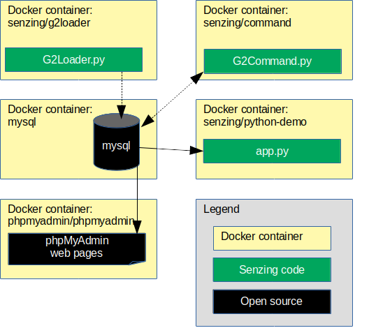

# docker-compose-mysql-demo

## :no_entry: Deprecated

This repository was an early example of a docker-compose formation
using Senzing with dockerized Python scripts.
It is deprecated and will not be maintained.

It has been replaced by
[github.com/Senzing/docker-compose-demo](https://github.com/Senzing/docker-compose-demo)
which shows docker-compose formations for multiple databases.

[](http://unmaintained.tech/)

## Overview

The following diagram shows the relationship of the docker containers in this docker composition.



This docker formation brings up the following docker containers:

1. *[mysql](https://hub.docker.com/_/mysql)*
1. *[phpmyadmin/phpmyadmin](https://hub.docker.com/r/phpmyadmin/phpmyadmin)*
1. *[senzing/python-demo](https://github.com/Senzing/docker-python-demo)*

Also shown in the demonstration are commands to run the following Docker images:

1. *[senzing/g2loader](https://github.com/Senzing/docker-g2loader)* in [Run G2Loader.py](#run-g2loaderpy)
1. *[senzing/g2command](https://github.com/Senzing/docker-g2command)* in [Run G2Command.py](#run-g2commandpy)

### Contents

1. [Expectations](#expectations)
    1. [Space](#space)
    1. [Time](#time)
    1. [Background knowledge](#background-knowledge)
1. [Preparation](#preparation)
    1. [Prerequisite Software](#prerequisite-software)
    1. [Clone repository](#clone-repository)
    1. [Create SENZING_DIR](#create-senzing_dir)
1. [Using docker-compose](#using-docker-compose)
    1. [Build docker images](#build-docker-images)
    1. [Configuration](#configuration)
    1. [Launch docker formation](#launch-docker-formation)
    1. [Initialize database](#initialize-database)
    1. [Sample python app](#sample-python-app)
    1. [Run G2Loader.py](#run-g2loaderpy)
    1. [Run G2Command.py](#run-g2commandpy)
1. [Cleanup](#cleanup)

## Expectations

### Space

This repository and demonstration require 6 GB free disk space.

### Time

Budget 2 hours to get the demonstration up-and-running, depending on CPU and network speeds.

### Background knowledge

This repository assumes a working knowledge of:

1. [Docker](https://github.com/Senzing/knowledge-base/blob/master/WHATIS/docker.md)
1. [Docker-Compose](https://github.com/Senzing/knowledge-base/blob/master/WHATIS/docker-compose.md)

## Preparation

### Prerequisite software

The following software programs need to be installed:

1. [docker](https://github.com/Senzing/knowledge-base/blob/master/HOWTO/install-docker.md)
1. [docker-compose](https://github.com/Senzing/knowledge-base/blob/master/HOWTO/install-docker-compose.md)

### Clone repository

1. Set these environment variable values:

    ```console
    export GIT_ACCOUNT=senzing
    export GIT_REPOSITORY=docker-compose-mysql-demo
    ```

1. Follow steps in [clone-repository](https://github.com/Senzing/knowledge-base/blob/master/HOWTO/clone-repository.md) to install the Git repository.

1. After the repository has been cloned, be sure the following are set:

    ```console
    export GIT_ACCOUNT_DIR=~/${GIT_ACCOUNT}.git
    export GIT_REPOSITORY_DIR="${GIT_ACCOUNT_DIR}/${GIT_REPOSITORY}"
    ```

### Create SENZING_DIR

If you do not already have an `/opt/senzing` directory on your local system, visit
[HOWTO - Create SENZING_DIR](https://github.com/Senzing/knowledge-base/blob/master/HOWTO/create-senzing-dir.md).

## Using docker-compose

### Build docker images

1. Build docker images.

    ```console
    sudo docker build --tag senzing/mysql   https://github.com/senzing/docker-mysql.git
    ```

### Configuration

* **MYSQL_DATABASE** -
  The database name.
  Default: "G2"
* **MYSQL_PASSWORD** -
  Password for MYSQL_USERNAME user.
  Default: "g2"
* **MYSQL_ROOT_PASSWORD** -
  The password for the the database "root" user name.
  Default: "root"
* **MYSQL_STORAGE** -
  Path on local system where the database files are stored.
  Default: "/storage/docker/senzing/docker-compose-mysql-demo"
* **MYSQL_USERNAME** -
  Non-root username.
  Default: "g2"
* **SENZING_DIR** -
  Path on the local system where
  [Senzing_API.tgz](https://s3.amazonaws.com/public-read-access/SenzingComDownloads/Senzing_API.tgz)
  has been extracted.
  See [Create SENZING_DIR](#create-senzing_dir).
  No default.
  Usually set to "/opt/senzing".

### Launch docker formation

#### Variation 1

1. :pencil2: Set environment variables.  Example:

    ```console
    export MYSQL_DATABASE=G2
    export MYSQL_PASSWORD=g2
    export MYSQL_ROOT_PASSWORD=root
    export MYSQL_STORAGE=/storage/docker/senzing/docker-compose-mysql-demo
    export MYSQL_USERNAME=g2
    export SENZING_DIR=/opt/senzing
    ```

1. Launch docker-compose formation.  Example:

    ```console
    cd ${GIT_REPOSITORY_DIR}

    sudo \
     MYSQL_DATABASE=${MYSQL_DATABASE} \
     MYSQL_PASSWORD=${MYSQL_PASSWORD} \
     MYSQL_ROOT_PASSWORD=${MYSQL_ROOT_PASSWORD} \
     MYSQL_STORAGE=${MYSQL_STORAGE} \
     MYSQL_USERNAME=${MYSQL_USERNAME} \
     SENZING_DIR=${SENZING_DIR} \
     docker-compose up
    ```

    **Note:** The log will show errors from `senzing-app` until the database has been initialized in the next step.

#### Variation 2

Launch docker-compose formation with "diskless mysql".
In this docker formation, the mysql docker container does not externalize `/var/lib/mysql`.
This is done by using docker's `--tmpfs` parameter rather than its `--volume` parameter.

1. :pencil2: Set environment variables.  Example:

    ```console
    export MYSQL_DATABASE=G2
    export MYSQL_PASSWORD=g2
    export MYSQL_ROOT_PASSWORD=root
    export MYSQL_USERNAME=g2
    export SENZING_DIR=/opt/senzing
    ```

1. Launch docker-compose formation.  Example:

    ```console
    cd ${GIT_REPOSITORY_DIR}

    sudo \
     MYSQL_DATABASE=${MYSQL_DATABASE} \
     MYSQL_PASSWORD=${MYSQL_PASSWORD} \
     MYSQL_ROOT_PASSWORD=${MYSQL_ROOT_PASSWORD} \
     MYSQL_USERNAME=${MYSQL_USERNAME} \
     SENZING_DIR=${SENZING_DIR} \
     docker-compose --file docker-compose-diskless-mysql.yaml up
    ```

    **Note:** The log will show errors from `senzing-app` until the database has been initialized in the next step.

### Initialize database

1. The database will be initialized using phpMyAdmin at [localhost:8080](http://localhost:8080).
1. Login with values specified for `MYSQL_USERNAME` and `MYSQL_PASSWORD`.
1. In the left-hand navigation, highlight "G2" database.
1. Click "Import" tab.
1. Click "Browse..." button and locate `/opt/senzing/g2/data/g2core-schema-mysql-create.sql`
1. Click "Go" button.

### Sample python app

1. After the schema and data are loaded,
   the demonstration
   [python/Flask](https://github.com/Senzing/docker-python-demo)
   app will be available at
   [localhost:5000](http://localhost:5000).

### Run G2Loader.py

For more information on `senzing/g2loader` configuration and usage, see
[senzing/docker-g2loader](https://github.com/Senzing/docker-g2loader).

In a separate terminal window:

1. :pencil2: Determine docker network. Example:

    ```console
    sudo docker network ls

    # Choose value from NAME column of docker network ls
    export SENZING_NETWORK=nameofthe_network
    ```

1. :pencil2: Set environment variables.  Example:

    ```console
    export DATABASE_DATABASE=G2
    export DATABASE_PASSWORD=g2
    export DATABASE_USERNAME=g2
    export SENZING_DIR=/opt/senzing
    ```

1. Run `docker` command. Example:

    ```console
    export DATABASE_HOST=senzing-mysql
    export DATABASE_PORT=3306
    export DATABASE_PROTOCOL=mysql
    export SENZING_DATABASE_URL="${DATABASE_PROTOCOL}://${DATABASE_USERNAME}:${DATABASE_PASSWORD}@${DATABASE_HOST}:${DATABASE_PORT}/${DATABASE_DATABASE}"

    sudo docker run \
      --env SENZING_DATABASE_URL="${SENZING_DATABASE_URL}" \
      --interactive \
      --net ${SENZING_NETWORK} \
      --rm \
      --tty \
      --volume ${SENZING_DIR}:/opt/senzing \
      senzing/g2loader \
        --purgeFirst \
        --projectFile /opt/senzing/g2/python/demo/sample/project.csv
    ```

### Run G2Command.py

For more information on `senzing/g2command` configuration and usage, see
[senzing/docker-g2command](https://github.com/Senzing/docker-g2command).

In a separate terminal window:

1. :pencil2: Determine docker network. Example:

    ```console
    sudo docker network ls

    # Choose value from NAME column of docker network ls
    export SENZING_NETWORK=nameofthe_network
    ```

1. :pencil2: Set environment variables.  Example:

    ```console
    export DATABASE_DATABASE=G2
    export DATABASE_PASSWORD=g2
    export DATABASE_USERNAME=g2
    export SENZING_DIR=/opt/senzing
    ```

1. Run `docker` command. Example:

    ```console
    export DATABASE_HOST=senzing-mysql
    export DATABASE_PORT=3306
    export DATABASE_PROTOCOL=mysql
    export SENZING_DATABASE_URL="${DATABASE_PROTOCOL}://${DATABASE_USERNAME}:${DATABASE_PASSWORD}@${DATABASE_HOST}:${DATABASE_PORT}/${DATABASE_DATABASE}"

    sudo docker run \
      --env SENZING_DATABASE_URL="${SENZING_DATABASE_URL}" \
      --interactive \
      --net ${SENZING_NETWORK} \
      --rm \
      --tty \
      --volume ${SENZING_DIR}:/opt/senzing \
      senzing/g2command
    ```

## Cleanup

In a separate terminal window:

1. Run `docker-compose` command.

    ```console
    cd ${GIT_REPOSITORY_DIR}
    sudo docker-compose down
    ```

1. Delete database storage.

    ```console
    sudo rm -rf ${MYSQL_STORAGE}
    ```

1. Delete SENZING_DIR.

    ```console
    sudo rm -rf ${SENZING_DIR}
    ```

1. Delete git repository.

    ```console
    sudo rm -rf ${GIT_REPOSITORY_DIR}
    ```
